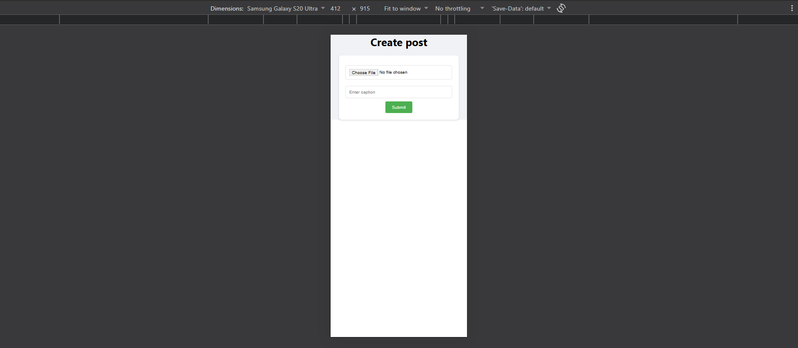
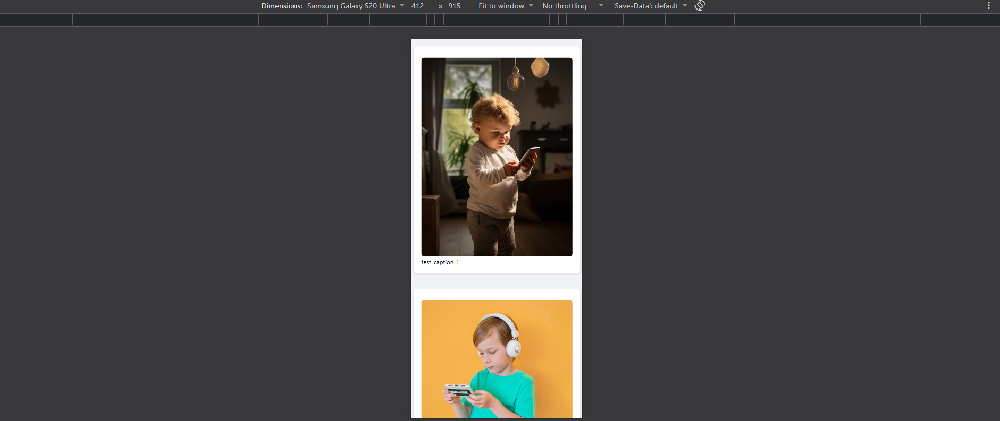

# 📝 Social Media Post App

A full-stack web application where users can create posts with an image and caption, and view posts in a feed.

## 🚀 Features

* 📸 Create a post with an image
* ✍️ Add a caption
* 📰 View posts in a feed
* 🗄️ Store post data in MongoDB
* 🔗 REST API with Express.js
* ⚛️ React frontend
* ☁️ Deployed frontend and backend

## 🌐 Live Demo

### Frontend

**Create Post:**
https://social-media-post-app-mu.vercel.app/create-post

**Feed:**
https://social-media-post-app-mu.vercel.app/feed

### Backend API

**Get Posts:**
https://social-media-post-backend-e6pkpclox-raviii2.vercel.app/posts

## 🛠️ Tech Stack

### Frontend

* React.js
* JavaScript
* HTML
* CSS
* Axios

### Backend

* Node.js
* Express.js
* MongoDB
* Mongoose
* Multer
* ImageKit

## 📂 Project Structure

```text
project/
├── frontend/
├── backend/
├── screenshots/
│   ├── create-post-ss.png
│   └── feed-ss.png
├── .gitignore
└── README.md
```

## 📸 Screenshots

### Create Post



### Feed



## ⚙️ Installation & Setup

### 1. Clone the Repository

```bash
git clone https://github.com/ravi1361/social-media-post-app.git
cd social-media-post-app
```

### 2. Install Frontend Dependencies

```bash
cd frontend
npm install
```

### 3. Install Backend Dependencies

```bash
cd ../backend
npm install
```

### 4. Environment Variables

Create a `.env` file inside the `backend` folder:

```env
MONGO_URI=your_mongodb_connection_string
PORT=3000
```

> ⚠️ Never upload your `.env` file to GitHub.

### 5. Start the Backend

Inside the `backend` folder:

```bash
npm run dev
```

### 6. Start the Frontend

Inside the `frontend` folder:

```bash
npm run dev
```

## 🔌 API

### Create Post

```http
POST /create-post
```

Creates a new post with an image and caption.

### Get Posts

```http
GET /posts
```

Fetches posts from MongoDB and displays them in the feed.

## 🎯 What I Learned

* Building a React frontend
* Creating REST APIs using Express.js
* Connecting MongoDB with Mongoose
* Handling image uploads with Multer
* Uploading images using ImageKit
* Connecting frontend and backend
* Using environment variables
* Deploying frontend and backend with Vercel
* Using Git and GitHub

## 👨‍💻 Author

**Ravi Hiremath**

Built with React, Node.js, Express.js and MongoDB.
